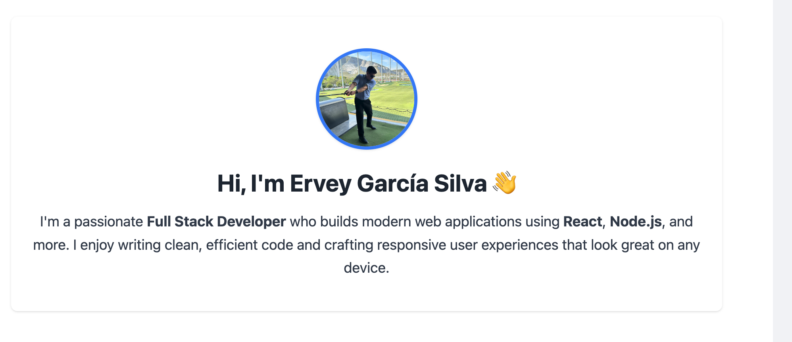

# 💼 React Portfolio – Ervey García Silva

Welcome! This is my personal portfolio built using **React** and **Vite**, styled with **Tailwind CSS**.  
It showcases a collection of my recent web development projects, skills, and contact information.

> 🚀 **Live Site:** [https://react-portfolio-8vj4.onrender.com](https://react-portfolio-8vj4.onrender.com)

---

## 🧠 About Me

I'm **Ervey García Silva**, a passionate Full Stack Developer who builds modern web applications using  
**React**, **Node.js**, and more. I enjoy writing clean, efficient code and creating responsive user experiences.

---

## ✨ Features

- ✅ Single Page Application using **React Router**
- ✅ Responsive design with **Tailwind CSS**
- ✅ Animated and styled **project cards**
- ✅ Validated **contact form** with real-time feedback
- ✅ Clean UI/UX with mobile-first layout
- ✅ Deployed on **Render**

---

## 🖼️ Screenshot



---

## 📁 Sections

- **About Me**: Profile picture and bio
- **Portfolio**: Gallery of 4+ deployed projects with GitHub and live links
- **Resume**: Downloadable PDF + list of proficiencies
- **Contact**: Form with validation + direct email link

---

## 🛠️ Technologies

- React
- Vite
- Tailwind CSS
- React Router DOM
- Render (deployment)

---

## 📫 Contact

If you’d like to connect, feel free to reach out:

- 📧 erveygarcia@yahoo.com.mx  
- 💻 [GitHub](https://github.com/erveygarcia)  
- 💼 [LinkedIn](https://linkedin.com/in/erveygarcia)  
- 🧠 [Stack Overflow](https://stackoverflow.com/users/tuusuario) <!-- cámbialo si tienes ID real -->

---

## 📂 Installation (optional for devs)

```bash
git clone https://github.com/erveygarcia/react-portfolio.git
cd react-portfolio
npm install
npm run dev
